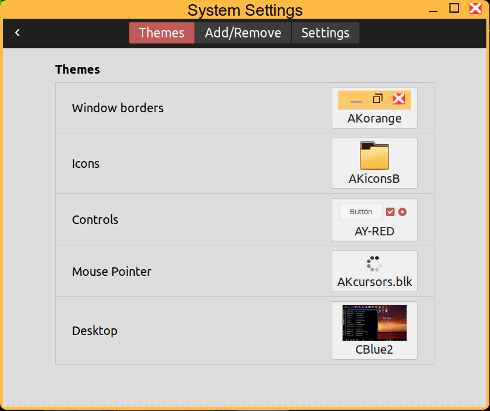
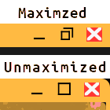

# AKorange
AKorange is a border theme with what I think is a uniq min/max icon.

In the image below the maximized border shows the middle icon that looks like 2 windows indicating clicking this icon will make the window unmaximized.
The 2nd example is the border when unmaximized showing a square icon indicating clicking here will make the window large or maximized.  Also when unmaximized the border corners are slightly rounded.

INSTALLATION:
Copy the AKorange folder into ~/.themes folder for personal use.  Create ~/.themes if not there already.
Copy to /usr/share/themes for global use.
Use cinnamon-settings: Settings->Themes to select this theme for borders.

Customization Hint:
With very little work you could make almost any color variation of this theme for your own personal use.  Lighter colors would be easier than a dark color but your could try.   Locate the metacity-theme-3.xml file in the metacity-1 folder.  These 4 lines at the beginning of that file are the basic colors of the border and border text. 
  constant name="C_title_focused" value="#000000" 
  constant name="C_title_unfocused" value="#888888" 
  constant name="C_wm_bg_focused" value="#FFBA42" 
  constant name="C_wm_bg_unfocused" value="#FDD38B" 
The first 2 lines are the text color, focused & unfocused.
The last 2 lines are the background color, focused & unfocused.
Almost any color picker program that will display a hex color code will work.  There are many web pages also that will do color picking. Just don't change the syntax like removing quotes etc, just change the 6 digit color code and keep the # in front of the 6 digits.

