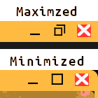

# AKorange
AKorange is a border theme with what I think is a uniq min/max icon.

In the image below the maximized border shows the middle icon that looks like 2 windows indicating clicking this icon will make the window unmaximized.
The 2nd example is the border when unmaximized showing a square icon indicating clicking here will make the window large or maximized.  Also when unmaximized the border corners are slightly rounded.

INSTALLATION:
Copy the AKorange folder into ~/.themes folder for personal use.
Copy to /usr/share/themes for global use.
Use cinnamon-settings: Settings->Themes to select this theme for borders.

